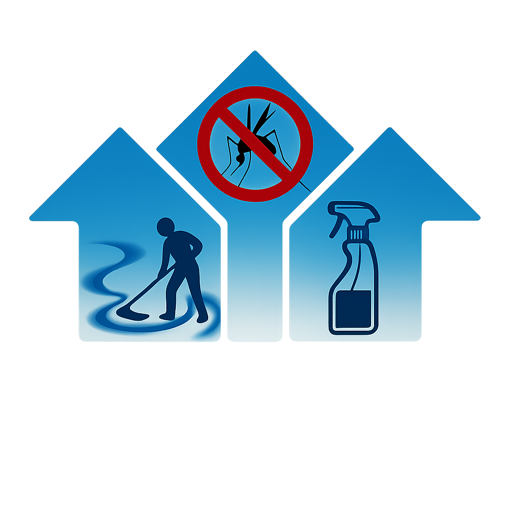
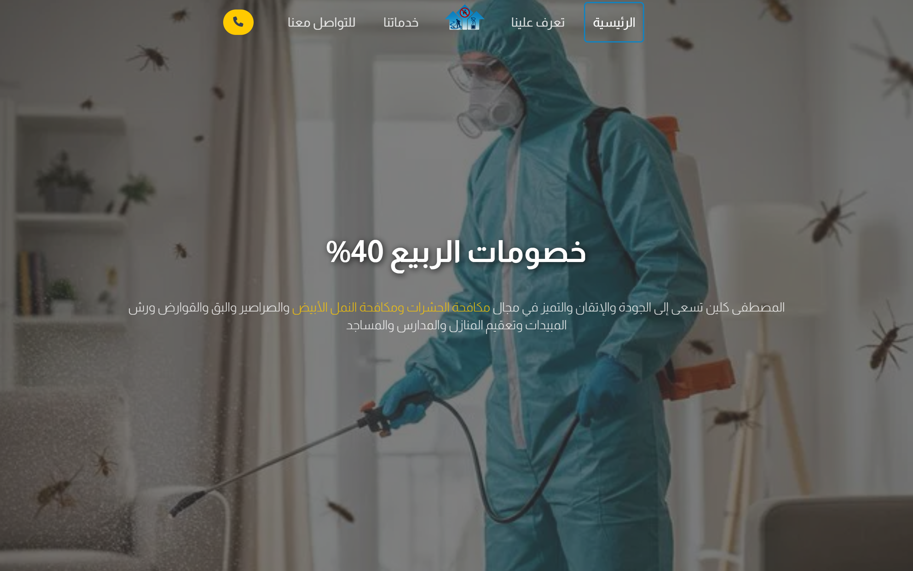
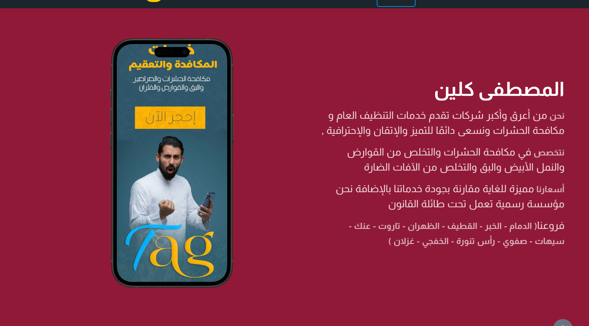
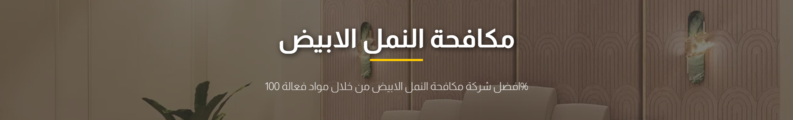
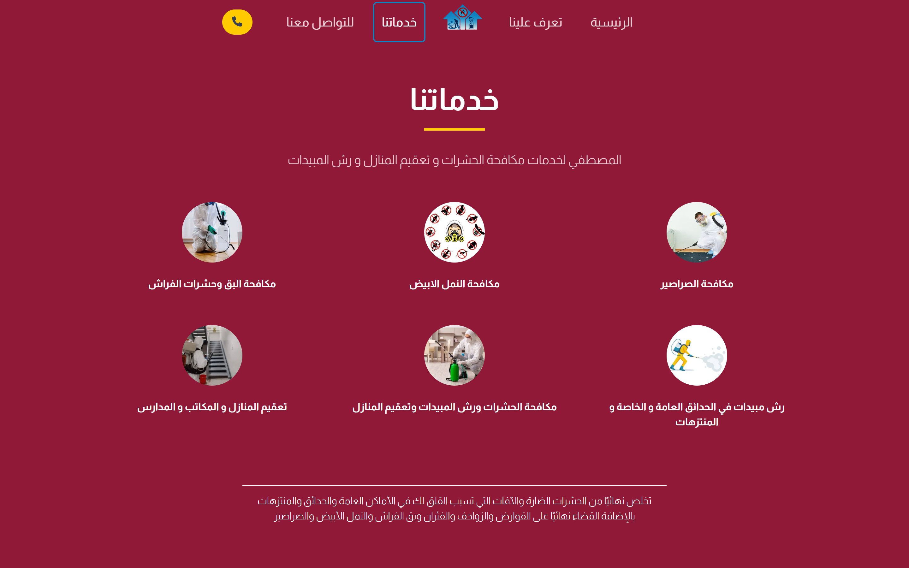
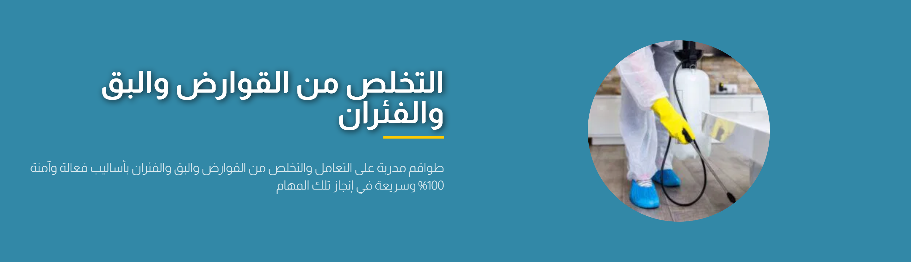
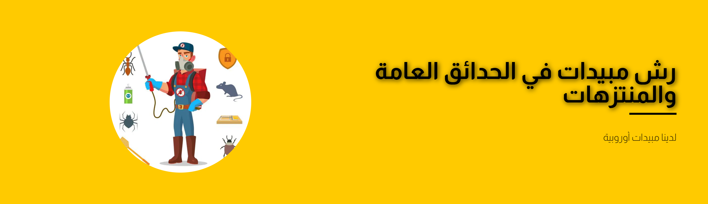
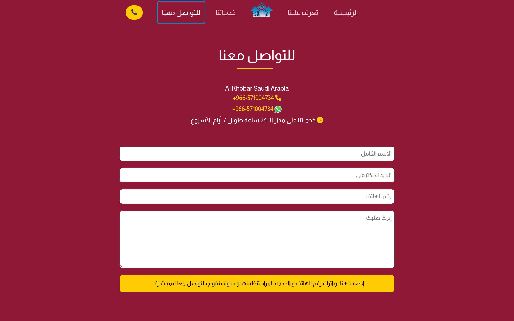
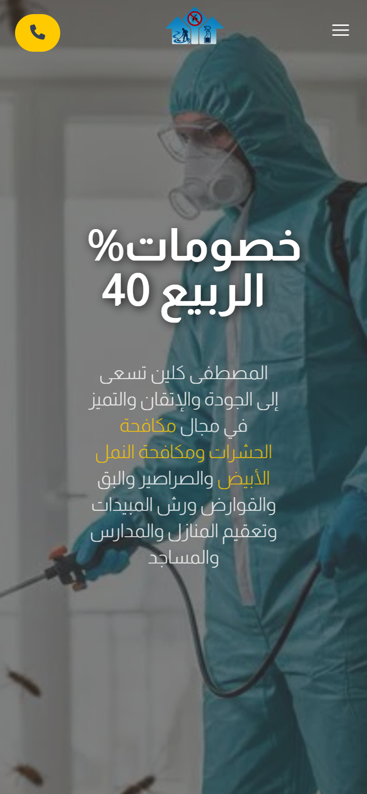
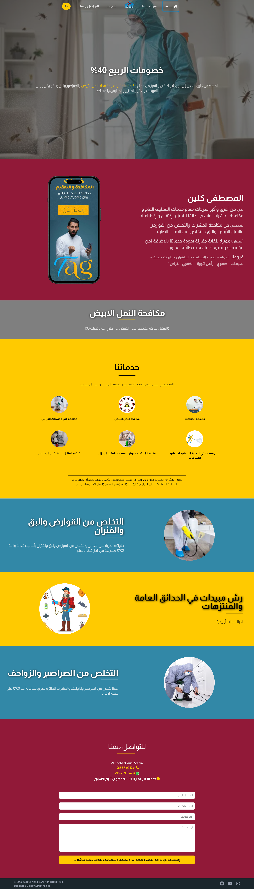

<div align="center">

  

  # 🏢 شركة المصطفى كلين | Al-Mustafa Clean
  ### Modern High-Converting Commercial Landing Page for KSA Pest Control & Sterilization

  <p align="center">
    A production-grade, RTL-first commercial web application designed and built for <strong>Al-Mustafa Clean</strong> — one of the Eastern Province's premier pest control and sterilization service providers in the Kingdom of Saudi Arabia.
  </p>

  [](https://ksa-afflite.vercel.app/)
  [](https://react.dev/)
  [](https://vitejs.dev/)
  [](https://tailwindcss.com/)
  []()

  <br />

  🔗 **[🌐 View Live Landing Page](https://ksa-afflite.vercel.app/)** &nbsp;|&nbsp; 💬 **[WhatsApp Instant Booking](https://wa.me/966571004734)** &nbsp;|&nbsp; 📞 **[Call Hotline: +966-571004734](tel:+966571004734)**

</div>

---

## 🌟 Executive Summary

**Al-Mustafa Clean** is a high-performance commercial single-page application (SPA) tailored to the Saudi Arabian market. Operating across major cities in the Eastern Province (**Khobar, Dammam, Dhahran, Qatif, Saihat, Safwa, Ras Tanura, Khafji, and Ghazlan**), the landing page delivers a frictionless conversion funnel with one-tap WhatsApp booking, immediate hotline access, dynamic inquiry forms, and responsive visual storytelling.

### 🎯 Key Engineering Goals
- **RTL-First Design**: Native Arabic typography utilizing the Google Almarai font family for optimal legibility and engagement.
- **Micro-Interactions & Depth**: Immersive parallax background depth (`react-scroll-parallax`) and scroll-triggered entrance animations (`AOS`).
- **Validated Booking Pipeline**: Robust lead capture form using `Formik` and `Yup` integrated with asynchronous backend submission.
- **Blazing Fast Performance**: Sub-second load times powered by Vite 6 and Tailwind CSS v4.
- **Production Resilience**: Zero-downtime continuous deployment on Vercel with dedicated SPA route rewrite handling.

---

## 📸 Visual Showcase & Feature Highlights

### 1. Hero Header & Seasonal Campaign
> Engaging top-of-funnel hero featuring a dynamic parallax background, high-contrast promotional badge (*40% Spring Discounts*), and instant call-to-action triggers.



---

### 2. Company Profile & Regional Coverage
> Trust-building section spotlighting the company's licensed legal standing, 24/7 service availability, and comprehensive branch coverage across the Eastern Province.



---

### 3. Specialized Termite Control & Anti-Pest Banners
> Visual divider section utilizing layered scroll parallax to highlight specialized white-ant (termite) eradication treatments.



---

### 4. Interactive Core Services Catalog
> A curated 6-card service grid detailing treatments for bedbugs, termites, cockroaches, residential sterilization, commercial facilities, and parks/gardens.



---

### 5. Specialized Treatment Focus Sections
> Alternating high-impact visual features detailing treatment methodologies, safety standards, and 100% human-safe chemical certifications.

| Rodents & Mice Eradication | Parks & Gardens European Spraying |
| :---: | :---: |
|  |  |

| Cockroaches & Crawling Reptiles Control | Formik-Validated Instant Booking & 24/7 Hotline |
| :---: | :---: |
|  |  |

---

### 6. Mobile Experience & Full Page Overview
> Optimized for the Saudi market where over 85% of traffic originates from mobile devices. Features responsive navigation drawer, touch-friendly CTA buttons, and fluid typography.

| Mobile View (iPhone 15 Pro) | Full Desktop Landing Page |
| :---: | :---: |
|  |  |

---

## 🛠️ Technology Stack

| Category | Technology | Purpose / Highlights |
| :--- | :--- | :--- |
| **Core Framework** | [React 19](https://react.dev/) | Latest React concurrent features and high-performance component rendering |
| **Build Tool** | [Vite 6](https://vitejs.dev/) | Instant HMR, tree-shaking, and optimized production bundling |
| **Styling & UI** | [Tailwind CSS v4](https://tailwindcss.com/) & [Styled Components](https://styled-components.com/) | Modern utility-first CSS paired with scoped styled elements |
| **Routing** | [React Router DOM v7](https://reactrouter.com/) | Client-side routing with deep link support for `/تعرف-علينا`, `/خدماتنا`, `/تواصل-معنا` |
| **Animations** | [AOS](https://michalsnik.github.io/aos/) & [React Scroll Parallax](https://react-scroll-parallax.damodeo.com/) | Smooth on-scroll reveals and multi-layered depth effects |
| **Forms & Validation** | [Formik](https://formik.org/) + [Yup](https://github.com/jquense/yup) | Strict schema validation for names, phone numbers, and inquiry details |
| **HTTP & API** | [Axios](https://axios-http.com/) | Asynchronous order submissions to mail delivery microservice |
| **Typography & Icons** | [FontAwesome](https://fontawesome.com/) + Google Almarai | Comprehensive icon set and premium Arabic typography |
| **Deployment** | [Vercel](https://vercel.com/) | Global edge distribution with continuous integration from Git |

---

## 📂 Project Structure

```text
ksa-afflite/
├── public/                     # Static public assets
├── screenshots/                # High-resolution section & showcase screenshots
│   ├── 01_hero_header.png
│   ├── 02_about_company.png
│   ├── 03_termite_banner.png
│   ├── 04_services_grid.png
│   ├── 05_rodents_control.png
│   ├── 06_garden_spraying.png
│   ├── 07_insects_control.png
│   ├── 08_contact_section.png
│   ├── 09_mobile_showcase.png
│   └── 10_full_landing_page.png
├── scripts/                    # Automation utilities
│   └── capture_screenshots.js  # Automated Puppeteer viewport & element capture
├── src/
│   ├── assets/                 # Brand logos, mockups, and section banners
│   ├── components/             # Reusable modular UI components
│   │   ├── Footer/             # Social links, copyright, and regional info
│   │   ├── Header/             # Hero heading, discount badge, call triggers
│   │   ├── Layout/             # Global layout shell, back-to-top button
│   │   ├── Navbar/             # Responsive header navigation & hotline pill
│   │   ├── SubSecOne/          # White ants / termite banner with parallax
│   │   ├── SubSecTwo/          # Rodents & bedbugs eradication module
│   │   ├── SubSecThree/        # Parks & garden pesticide spraying module
│   │   ├── SubSecFour/         # Cockroaches & crawling reptiles module
│   │   └── ui/                 # Atomic UI primitives (Animation, Button, ServiceItem)
│   ├── pages/                  # Page route views
│   │   ├── Home/               # Complete composite landing page
│   │   ├── About/              # Dedicated company background view
│   │   ├── Service/            # Comprehensive 6-service grid
│   │   └── Contact/            # Formik-powered contact & booking page
│   ├── App.jsx                 # App router configuration & global providers
│   ├── main.jsx                # Application root entrypoint
│   └── index.css               # Global Tailwind CSS directives
├── vercel.json                 # Vercel SPA routing rewrite rules
├── vite.config.js              # Vite build & asset base path configuration
└── package.json                # Project dependencies and run scripts
```

---

## 🚀 Getting Started Locally

### Prerequisites
- **Node.js**: `v18.0.0` or later (tested on `v24.18.0`)
- **npm**: `v9.0.0` or later

### Installation

1. **Clone the repository:**
   ```bash
   git clone https://github.com/Ashraf-khaled-w/ksa-afflite.git
   cd ksa-afflite
   ```

2. **Install dependencies:**
   ```bash
   npm install
   ```

3. **Start the local development server:**
   ```bash
   npm run dev
   ```
   Open your browser at `http://localhost:5173`.

4. **Build for production:**
   ```bash
   npm run build
   ```

5. **Preview production build:**
   ```bash
   npm run preview
   ```

---

## ⚙️ Automated Screenshot Generation

This project includes a dedicated Puppeteer script that automatically captures crisp, high-resolution screenshots for each section and device layout:

```bash
node scripts/capture_screenshots.js
```
The script handles animation overrides, element bounding boxes, and viewport switching to keep the repository documentation updated effortlessly.

---

## 👨‍💻 Author & Engineering Profile

**Ashraf Khaled**  
*Full Stack / Frontend Developer*

- 🌐 **Portfolio & Projects**: [GitHub Profile](https://github.com/Ashraf-khaled-w)
- 💼 **LinkedIn**: [Connect on LinkedIn](https://www.linkedin.com/in/ashraf-khaled-w/)
- 📱 **Direct Contact / WhatsApp**: [+966-571004734](https://wa.me/966571004734)

---

<div align="center">
  <sub>Designed & Developed with ❤️ for <strong>شركة المصطفى كلين</strong>. All rights reserved © 2026.</sub>
</div>
